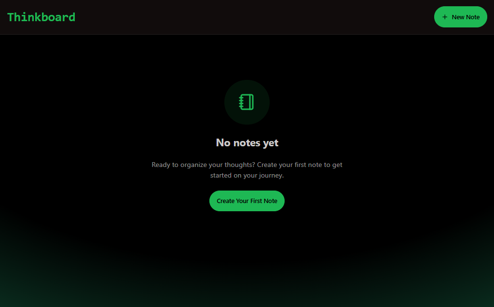
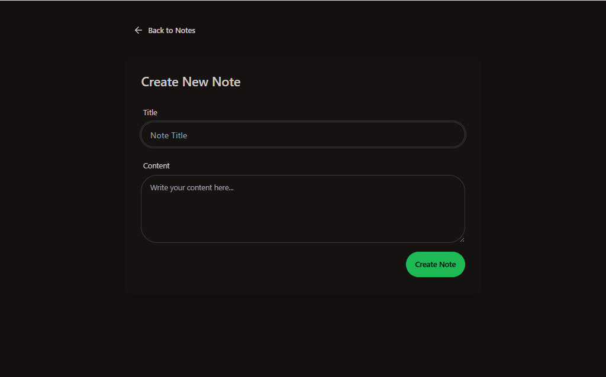
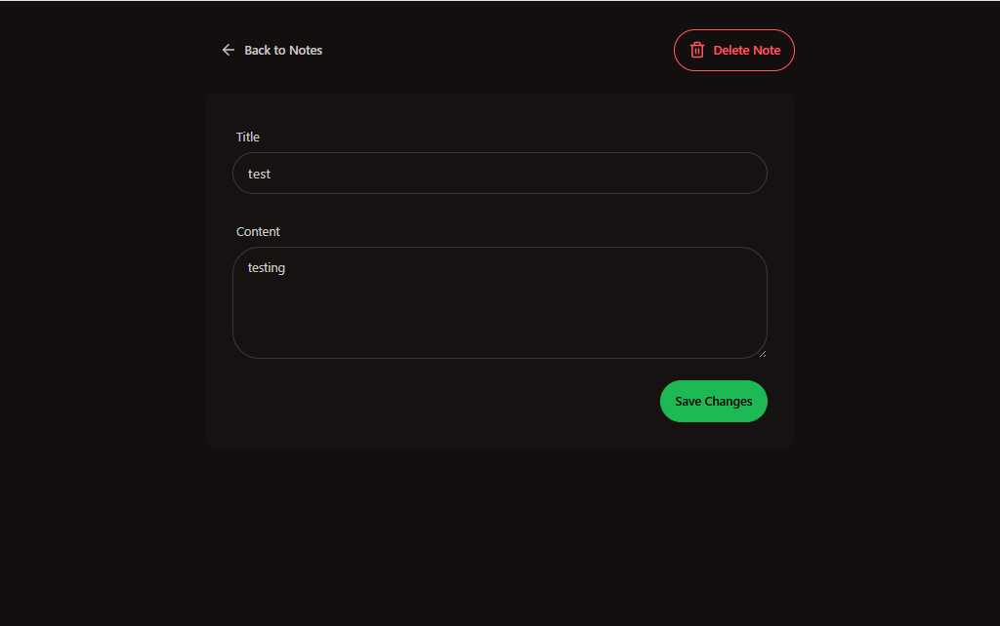
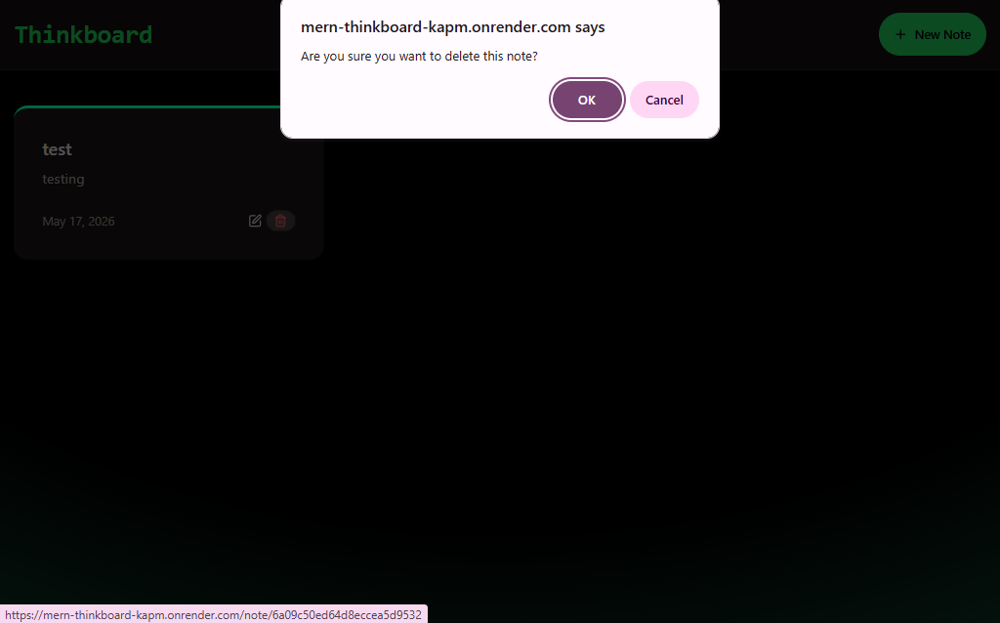
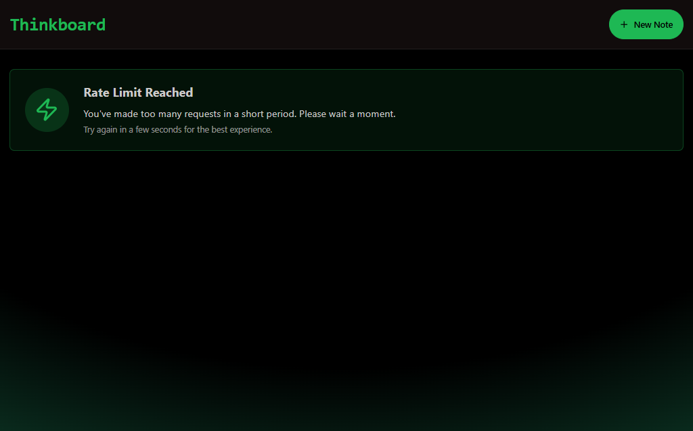

# ThinkBoard

ThinkBoard is a full-stack MERN notes application for creating, viewing, updating, and deleting notes in a clean, responsive interface. It combines a React frontend with an Express and MongoDB backend, and includes Upstash-powered rate limiting to protect the API from abuse.

---

## 🚀 Features

- Create new notes with a title and content
- View all notes in a responsive grid layout
- Edit existing notes
- Delete notes
- Real-time feedback with toast notifications
- Rate-limit handling UI for excessive requests
- Production-ready setup with frontend build served by the backend

---

## 🖼️ Preview & Screenshots

### 🔗 Live Preview
[Live Demo](https://mern-thinkboard-kapm.onrender.com)

---

### 📸 Screenshots

#### Home Page
UI before any notes.


---

#### Create Note Page
Interface for adding a new note with title and content.


---

#### Edit Note Page
Allows users to update existing notes.


---

#### Delete / Toast Feedback
Shows confirmation and toast notifications after actions.


---

#### Rate Limit Screen 
Displayed when API request limits are exceeded.


---

## 🛠️ Tech Stack

### Frontend
- React
- Vite
- React Router
- Axios
- Tailwind CSS
- DaisyUI
- Lucide React

### Backend
- Node.js
- Express.js
- MongoDB
- Mongoose
- Upstash Redis
- Upstash Rate Limit

---

## 📁 Project Structure

```bash
mern-thinkboard/
├── backend/
│   ├── src/
│   │   ├── config/
│   │   ├── controllers/
│   │   ├── middleware/
│   │   ├── models/
│   │   ├── routes/
│   │   └── server.js
│   └── package.json
├── frontend/
│   ├── src/
│   │   ├── components/
│   │   ├── lib/
│   │   ├── pages/
│   │   ├── App.jsx
│   │   └── main.jsx
│   └── package.json
├── screenshots/
│   ├── home.png
│   ├── create-note.png
│   ├── edit-note.png
│   ├── delete-note.png
│   └── rate-limit.png
└── package.json
``` 

---

## 🔐 Environment Variables

Create a `.env` file inside the backend folder:

```env
MONGO_URI=your_mongodb_connection_string
UPSTASH_REDIS_REST_URL=your_upstash_redis_rest_url
UPSTASH_REDIS_REST_TOKEN=your_upstash_redis_rest_token
PORT=5001
NODE_ENV=development
``` 

---

## ⚙️ Installation

### 1. Clone the repository

```bash
git clone https://github.com/laibatariq110/mern-thinkboard.git
cd mern-thinkboard
```

### 2. Install dependencies

```bash
npm install
npm install --prefix backend
npm install --prefix frontend
```

## ▶️ Run the App Locally

### Start backend

```bash
npm run dev --prefix backend
```

### Start frontend

```bash
npm run dev --prefix frontend
```

---

### 🌐 Local Development URLs

- Frontend: `http://localhost:5173`
- Backend: `http://localhost:5001`

---

## 🔌 API Endpoints

| Method | Endpoint | Description |
|--------|----------|-------------|
| GET | `/api/notes` | Get all notes |
| GET | `/api/notes/:id` | Get a note by ID |
| POST | `/api/notes` | Create a new note |
| PUT | `/api/notes/:id` | Update a note |
| DELETE | `/api/notes/:id` | Delete a note |

---

## 🚀 Production Build

Build the project with:

```bash
npm run build
```

In production, the Express backend serves the React frontend from `frontend/dist`.

---

## 📝 Notes

- CORS is enabled in development for `http://localhost:5173`
- API rate limiting is handled with Upstash Redis
- Notes are stored in MongoDB with timestamps
